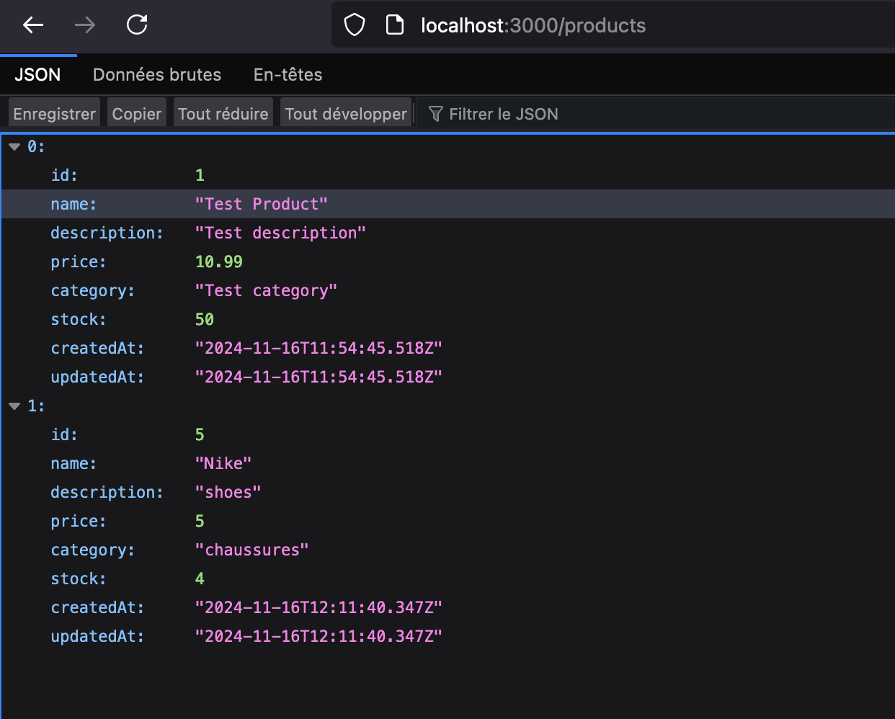
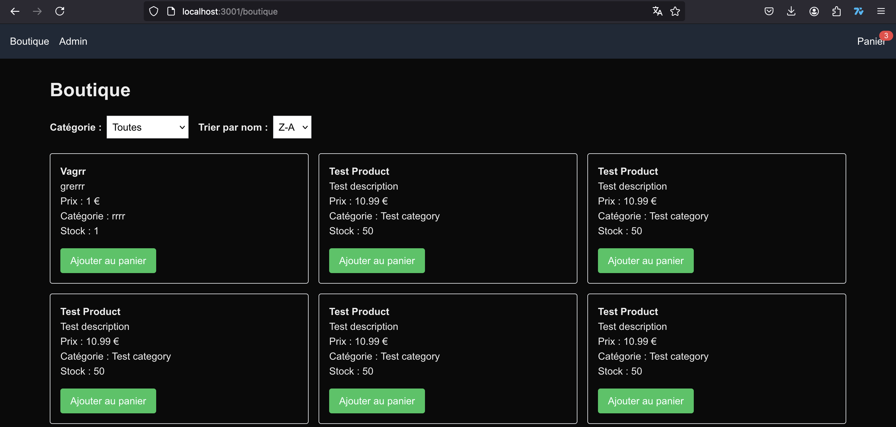
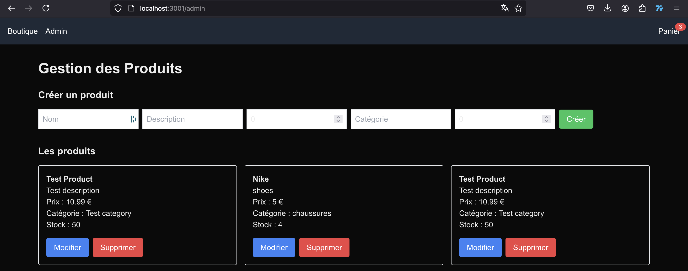
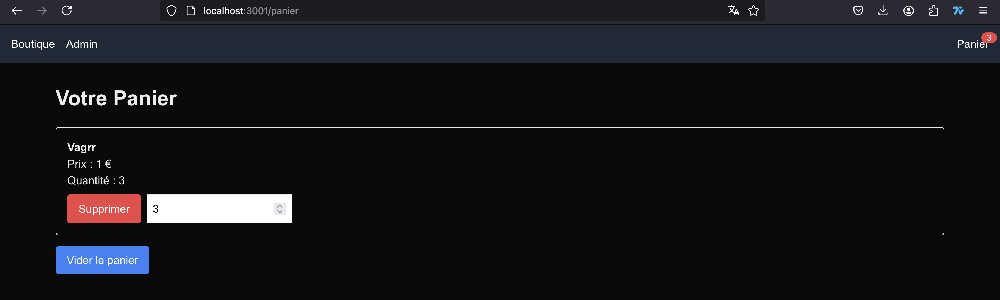

# Sujet : Création d’une boutique

## Démo

## Front (react / typescript) :
* un espace admin (page /admin)
* création, liste, mise à jour et suppression de produit
* un espace boutique (page /boutique)
* affichage des produits

## Back (NestJS / typescript) :
* API pour gérer les produit
* brancher sur la DB SQLite
* pusher le code avec des données de test dans la DB SQLite

## Bonus :
* utiliser Next JS
* gestion d’un panier
* gestion de catégories de produit (admin et shop)
* tri + filtre
* gestion d’authentification pour l’admin
* tests unitaires
* utilisation d'un docker-compose pour lancer la stack

## Note :
* Les 2 projets initialisés sur le repo sont une proposition et peuvent ne pas être utiliser
